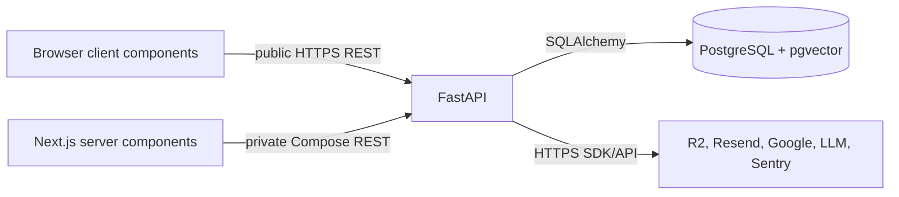
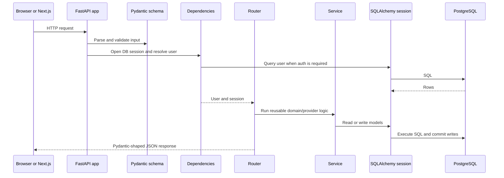
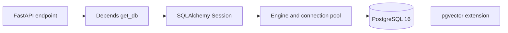
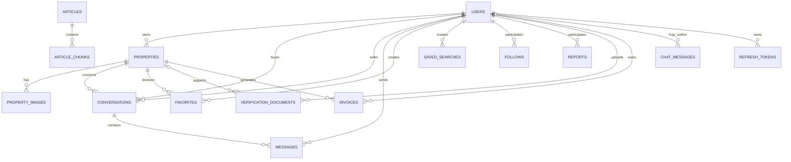
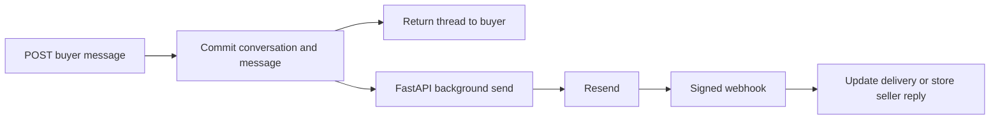

# DarSyria API And Database Architecture

This guide explains the internal structure of the FastAPI repository and how it
connects the Next.js frontend to PostgreSQL and external providers.

For the complete system view, including both frontend execution paths and the
production network, start with the
[`darsyria` system architecture](https://github.com/HikmatGhathe/darsyria/blob/main/ARCHITECTURE.md).

## Responsibility Boundary

FastAPI is the only application component allowed to access PostgreSQL or
private provider credentials. The browser and Next.js server communicate with
it over REST.



The API owns:

- Request validation and response contracts.
- Authentication, authorization, ownership, and admin checks.
- Business rules, limits, and state transitions.
- Database transactions and migrations.
- Private file storage, email, OAuth, AI retrieval, and monitoring.

The API does not render pages or own translated UI copy.

## Request Lifecycle



The exact transaction boundary depends on the operation. Routers usually own
the transaction, while a few focused services commit internally. Read the
called service before adding another commit or background task.

## Code Layout And Dependency Direction

```text
app/
  main.py           Application setup, middleware, routers, lifespan jobs
  config.py         Environment-backed settings
  database.py       Engine, SessionLocal, Base, get_db()
  dependencies.py   Current user, optional user, and admin dependencies
  cookies.py        Access and refresh cookie policy
  limiter.py        slowapi rate limiter
  observability.py  Sentry initialization
  routers/          HTTP boundary and endpoint orchestration
  schemas/          Pydantic input/output contracts
  services/         Business logic and external provider adapters
  models/           SQLAlchemy table mappings
alembic/             Ordered schema migrations
scripts/             Operational and data-ingestion commands
tests/               Behavior and regression tests
docs/                Deployment and operational guides
```

The intended direction is:

```text
HTTP -> router -> dependency/schema -> service/model -> database or provider
```

There is no generic repository/data-access layer. SQLAlchemy queries remain
close to the domain router or service that owns them. Add an abstraction only
when it removes real shared complexity.

## Router Map

| Domain | Route prefix | Access | Main implementation |
|---|---|---|---|
| Authentication and account | `/auth` | Public plus authenticated account routes | `routers/auth.py` |
| Listings and images | `/properties` | Public reads; owner writes | `routers/properties.py` |
| Seller profiles and follows | `/sellers` | Public reads; authenticated follow commands | `routers/sellers.py` |
| Favorites | `/favorites`, `/properties/.../favorite` | Authenticated | `routers/favorites.py` |
| Saved searches | `/saved-searches` | Authenticated | `routers/saved_searches.py` |
| Buyer enquiries | `/conversations` | Authenticated buyer | `routers/conversations.py` |
| Resend events | `/webhooks/resend` | Signed provider webhook | `routers/resend_webhooks.py` |
| Reports | `/reports` | Authenticated | `routers/reports.py` |
| Verification | `/verification` | Authenticated owner | `routers/verification.py` |
| Billing | `/billing` | Public config and authenticated invoices | `routers/billing.py` |
| AI assistant | `/chat` | Public, rate limited | `routers/chat.py` |
| Admin operations | `/admin/...` | Admin only | `routers/admin_*.py`, `routers/enquiry_analytics.py` |
| Sitemap feed | `/sitemap-data` | Public | `routers/sitemap.py` |

FastAPI also exposes generated OpenAPI documentation at `/docs` and `/redoc`.

## Authentication And Authorization

Authentication uses two httpOnly cookies:

| Cookie | Contents | Lifetime and scope | Server-side state |
|---|---|---|---|
| `darsyria_access_token` | Signed JWT | Short lived, path `/` | User is loaded from PostgreSQL on every authenticated request |
| `darsyria_refresh_token` | Opaque random token | Long lived, path `/auth` | Only its SHA-256 hash is stored; it is rotated on refresh |

`get_current_user` decodes the access token, loads the current user row, and
rejects deleted, unknown, or suspended users. `get_current_admin` checks the
freshly loaded row, so a stale JWT cannot preserve revoked admin access.

Magic-link raw tokens are never persisted. They normally exist only in the
email and verification request; development fallback logging can also print the
link when delivery fails. The database stores a hash, expiry, and used
timestamp. Google login uses a short-lived `oauth_states` row to bind the
callback to the initiating flow.

In production the cookie domain is derived from `FRONTEND_URL`, allowing the
same cookie to reach both `darsyria.me` and `api.darsyria.me`. CORS must include
the frontend origin and allow credentials.

## Database Connection

`app/database.py` creates one synchronous SQLAlchemy engine from
`DATABASE_URL`, with `pool_pre_ping=True`. `SessionLocal` creates request-scoped
sessions, and `get_db()` always closes them after the request.



Inside Docker Compose, the API receives a database URL whose host is the
`postgres` service. PostgreSQL is bound to `127.0.0.1:5432` for local operator
access and is not publicly routed by Caddy.

### Data Domains

| Domain | Tables | Important constraints |
|---|---|---|
| Identity | `users`, `magic_link_tokens`, `refresh_tokens`, `oauth_states` | Unique email/token hashes; expiring one-time state |
| Listings | `properties`, `property_images` | Owner foreign key; image rows cascade with a property |
| Enquiries | `conversations`, `messages`, `inbound_email_events` | One thread per property/buyer/seller; unique relay and provider IDs |
| Discovery | `favorites`, `follows`, `saved_searches` | Unique favorite and follow pairs; digest watermarks |
| Trust and safety | `reports`, `verification_documents` | Human review state; private R2 object keys |
| Billing | `invoices`, `app_settings` | Per-listing charge state and runtime flags |
| Knowledge | `articles`, `article_chunks`, `chat_messages` | Article chunks contain 1024-dimensional vectors |

### Main Relationships



UUIDs are the normal primary key, timestamps are timezone-aware, and foreign
key deletion behavior is explicit. Binary file bodies never live in these
tables.

## Migrations

Alembic is the only supported way to change the schema.

```bash
# Show the migration currently applied to the running database
docker compose exec api alembic current

# Show the repository head
docker compose exec api alembic heads

# Apply pending migrations
docker compose exec api alembic upgrade head
```

The container entrypoint runs `alembic upgrade head` before starting Uvicorn.
For a schema change:

1. Change the SQLAlchemy model.
2. Add one Alembic revision based on the committed head.
3. Review generated SQL, nullability, defaults, and backfills.
4. Test upgrade and downgrade against representative existing rows.
5. Update Pydantic contracts and affected API tests.

Never depend on `Base.metadata.create_all()` in production; it cannot express
ordered data migrations or safe backfills.

## External Providers

| Provider | Adapter | Data kept in PostgreSQL | Failure behavior |
|---|---|---|---|
| Cloudflare R2 | `services/r2_storage.py` | Object keys, public URLs, sizes, and ownership | API rejects failed uploads; private documents use presigned reads |
| Resend | `services/email_service.py`, enquiry email service, webhook router | Delivery IDs/status, messages, short-lived inbound audit | Accepted enquiry data remains visible even when delivery fails |
| Google OAuth | `services/google_oauth_service.py` | Expiring state and provider subject | Callback fails closed when state or user info is invalid |
| Embedding model | `services/embeddings.py` | Article chunk vectors | Model loads lazily and is cached on a Docker volume |
| OpenAI-compatible LLM | `services/llm_service.py` | Chat messages and usage metadata | `/chat` returns 503 rather than inventing a local answer |
| Sentry | `observability.py` | No application-domain rows | Disabled when no DSN is configured |

R2 public listing images and private verification documents are separate trust
classes. Production should configure a non-public bucket for verification
documents.

## Enquiry Relay Transaction Boundary

A buyer message is committed before the outbound Resend call is scheduled. It
therefore remains auditable if the provider is unavailable. Stable provider
IDs and webhook audit rows make delivery and inbound reply handling idempotent.



See the full
[`buyer-seller enquiry architecture`](https://github.com/HikmatGhathe/darsyria/blob/main/docs/architecture/buyer-seller-enquiry-email-relay.md)
for token routing, privacy rules, limits, states, and analytics.

## AI Retrieval Flow

The API stores curated article bodies and chunks in PostgreSQL. Each chunk has
an embedding. `/chat` embeds the incoming query, performs a pgvector cosine
distance search, adds the best excerpts to the system prompt, calls the
configured LLM, and records the answer plus usage metadata.

The LLM provider is replaceable through `LLM_BASE_URL`, `LLM_API_KEY`, and
`LLM_MODEL`; it is not coupled to a specific vendor SDK.

## Scheduled Work And Scaling Limit

`app/main.py` starts one in-process loop during FastAPI lifespan. It runs the
daily listing digest and enquiry maintenance. Request-triggered emails use
FastAPI background tasks.

This is appropriate for the current single API container. Before adding API
replicas, move scheduled work and delivery retries to a durable queue or a
single elected worker. Otherwise every replica can run the same schedule.

## Runtime And Deployment

`docker-compose.yml` owns four production services:

| Service | Role | Public exposure |
|---|---|---|
| `caddy` | TLS and host-based reverse proxy | Ports 80 and 443 |
| `frontend` | Next.js standalone server | No direct public port |
| `api` | Uvicorn/FastAPI | No direct public port |
| `postgres` | PostgreSQL + pgvector | Loopback/private network only |

Both repositories must be present as siblings because Compose builds the
frontend from `../darsyria`. Pushes to `main` run GitHub Actions, SSH to the VM,
pull both repositories, and rebuild the Compose stack.

See [`docs/launch-runbook.md`](docs/launch-runbook.md) for DNS, secrets, email,
backup, and release checks.

## Adding A Backend Feature

Use this order to keep the contract understandable:

1. Identify the owning router and tables.
2. Add the model and migration when persistence changes.
3. Define Pydantic input/output at the HTTP boundary.
4. Put reusable business or provider logic in a focused service.
5. Enforce authentication, ownership, and limits in the API.
6. Add tests for success, rejection, idempotency, and failure behavior.
7. Update `.env.example` and the launch runbook for new configuration.
8. Update the frontend typed client and system documentation.

## Non-Negotiable Invariants

- No browser or Next.js code connects directly to PostgreSQL.
- No private credential is returned by an API response.
- Authorization is checked server-side for every protected operation.
- Auth token hashes, not raw refresh or magic-link tokens, are persisted.
- Every schema change has an Alembic migration.
- User data is committed before a best-effort background notification.
- Provider webhooks are authenticated and idempotent.
- Private documents do not receive public R2 URLs.
- Arabic, German, and English are supported for user-facing communication.
